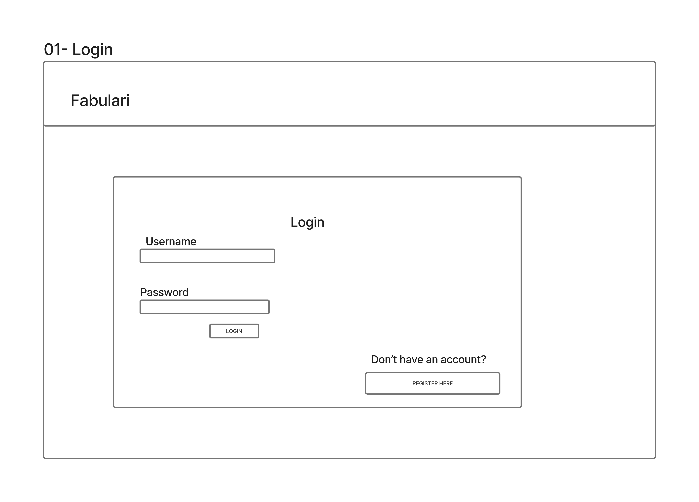
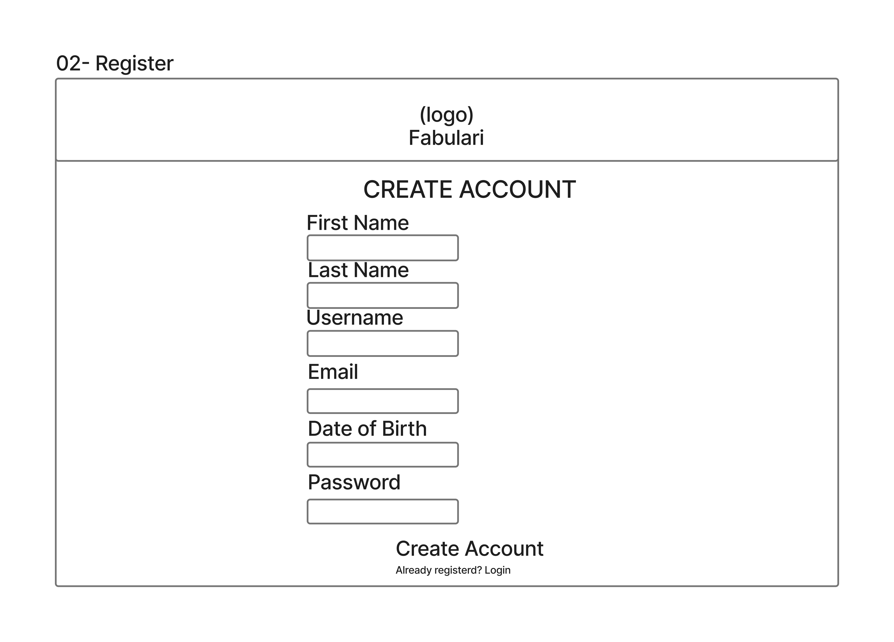
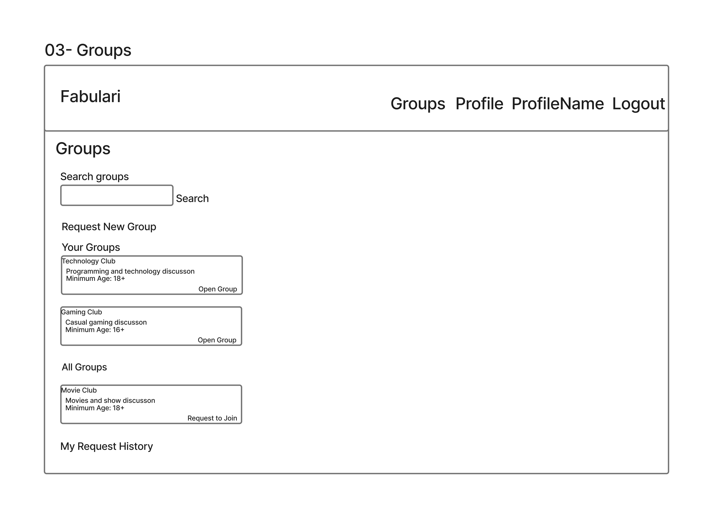
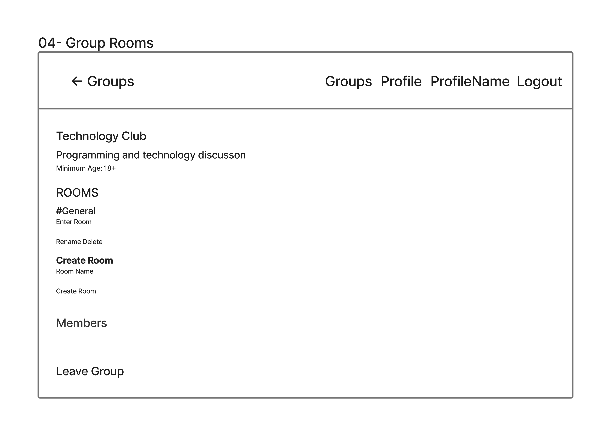
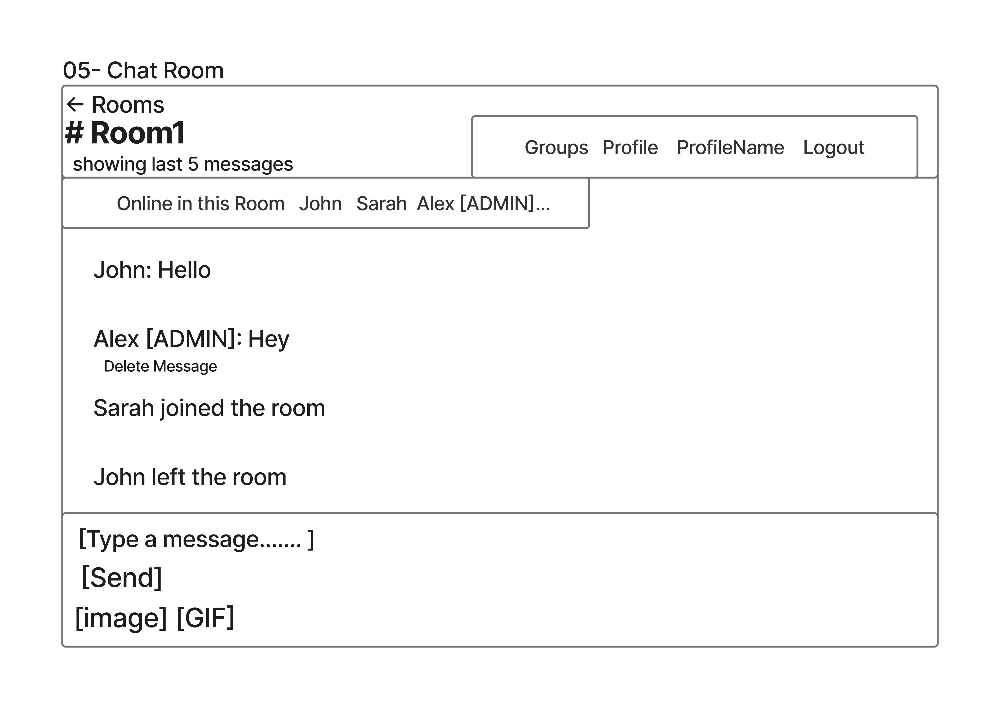
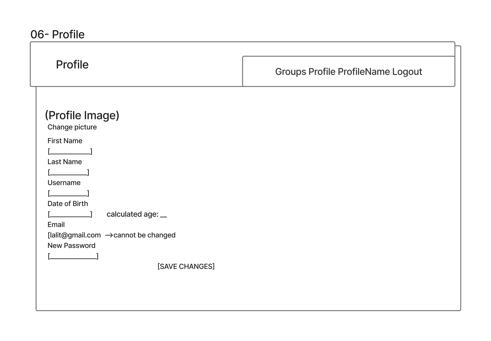
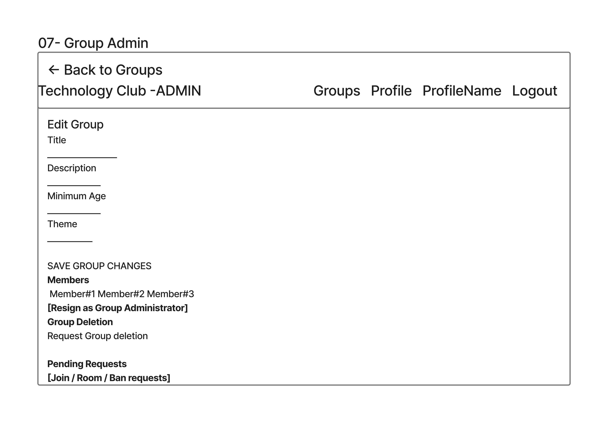
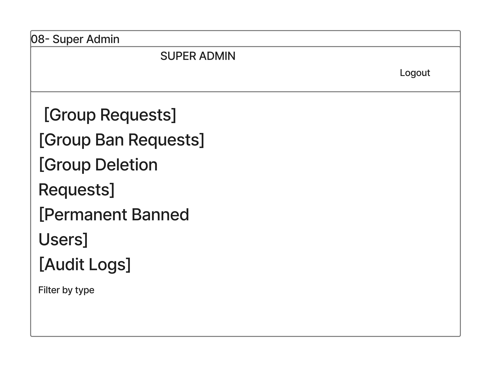

# Fabulari — Phase 2: Fully Functioning Application

## Student Information

**Name:** Lalit Bamel  
**Student Number:** s5383531  
**Workshop Time:** [ADD WORKSHOP DAY AND TIME]  
**GitHub Repository:** [ADD PRIVATE GITHUB REPOSITORY LINK]

---

# 1. Specifications and Requirements

## 1.1 Project Overview

Fabulari is a full-stack group-based real-time chat application.

The application allows users to create accounts, join communities, communicate
inside group chat rooms, upload images, manage profiles and participate in
administrative request workflows.

Different permissions are provided for:

- Normal Users.
- Group Administrators.
- The Super Administrator.

Phase 1 of Fabulari used JSON-file persistence and concentrated on the initial
requirements, architecture and prototype.

Phase 2 implements the complete application using:

- Angular.
- Node.js.
- Express.
- MongoDB.
- Socket.IO.

The Phase 2 application also introduces:

- Native MongoDB persistence.
- Real-time chat.
- Real-time room presence.
- Real-time membership synchronisation.
- Image uploads.
- Profile pictures.
- Administrative workflows.
- Automated testing.
- Improved validation.
- Responsive UI/UX.
- Accessibility improvements.

---

## 1.2 Development and Git Strategy

Git was used throughout the development of Fabulari.

Development work was performed using feature/development branches rather than
placing every change directly onto `main`.

A Phase 2 development branch was used for the major Phase 2 implementation:

`phase2/setup`

Changes were committed incrementally as features were implemented and tested.

Examples of development areas committed separately included:

- MongoDB integration.
- Image upload support.
- Automated testing.
- Real-time communication.
- Validation improvements.
- Membership and age-rule improvements.
- UI/UX improvements.

The repository was kept private and the teaching staff member was added as a
collaborator.

The Phase 2 branch is merged into `main` only after the final application,
documentation and testing are complete.

---

## 1.3 Technology Stack

Fabulari uses the MEAN stack together with Socket.IO.

| Technology | Purpose |
|---|---|
| Angular 22 | Frontend single-page application |
| TypeScript | Angular application development |
| Node.js | Backend JavaScript runtime |
| Express | REST API and HTTP server |
| MongoDB | Persistent database |
| Native MongoDB Node.js Driver | MongoDB communication |
| Socket.IO | Real-time bidirectional communication |
| RxJS | Angular real-time event subscriptions |
| bcrypt | Password hashing |
| Multer | Multipart image uploads |
| Mocha | Backend testing |
| Chai / Chai HTTP | Backend integration testing |
| Vitest | Angular unit testing |
| Angular TestBed | Angular testing environment |
| Cypress | End-to-end browser testing |

Mongoose is not used.

MongoDB communication is performed using the native MongoDB Node.js driver.

---

## 1.4 User Roles

Fabulari contains three main permission levels.

### Normal User

A normal user can:

- Register.
- Login.
- Edit their profile.
- Upload a profile picture.
- Browse groups.
- Search groups.
- Request group membership.
- Request creation of a new group.
- View request history.
- View rooms inside groups they belong to.
- Enter chat rooms.
- Send text messages.
- Send images.
- Send GIF messages.
- Delete their own messages.
- See users currently online in the room.
- Receive room join/leave notifications.
- Propose new rooms.
- Request a group ban against an eligible normal group member.
- Leave a group.

### Group Administrator

A Group Administrator has normal user capabilities and can additionally:

- Create rooms directly.
- Rename rooms.
- Delete rooms.
- Edit group information.
- Change the group theme.
- Change the minimum group age.
- Approve or reject join requests.
- Approve or reject room-creation requests.
- Approve or reject valid group-ban requests.
- Promote members to Group Administrator.
- Demote other Group Administrators when permitted.
- Resign as Group Administrator when another administrator remains.
- Request a system-wide ban.
- Request deletion of the group.

A group must always contain at least one administrator.

### Super Administrator

Fabulari contains one Super Administrator.

The Super Administrator can:

- Approve or reject group-creation requests.
- Approve or reject system-ban requests.
- Approve or reject group-deletion requests.
- View banned-user records.
- View audit logs.

The Super Administrator is not a normal chat participant.

The account is created using a controlled server bootstrap process rather than
public registration.

---

## 1.5 Authentication Requirements

Users register with:

- First name.
- Last name.
- Username.
- Email.
- Date of birth.
- Password.

The interface uses a calendar/date input for date of birth.

The user's age is calculated from their date of birth.

There is no system-wide Fabulari minimum age.

The client requirement only specifies minimum-age restrictions at group level.

However, invalid or unrealistic account ages are rejected.

The application prevents:

- Future dates of birth.
- Invalid dates.
- An effective age of zero.
- Negative age values.
- Non-integer age values used internally.
- Duplicate email addresses.
- Case-insensitive duplicate usernames.

Passwords must:

- Contain at least eight characters.
- Contain at least one uppercase character.

Passwords are hashed using bcrypt before MongoDB storage.

Plain-text passwords are never stored.

---

## 1.6 Profile Requirements

Users can view and edit their profile.

Editable information includes:

- First name.
- Last name.
- Username.
- Date of birth.
- Password.
- Profile picture.

The registered email address cannot be changed.

Date of birth is edited using a calendar input rather than by manually typing
an age.

When the date of birth changes, the user's age is recalculated.

The backend also rechecks the user's group eligibility.

If the new age becomes lower than a group's minimum age:

- A normal member is removed from that group.
- An administrator can be removed if another administrator remains.
- If the user is the only administrator, the age/profile change is rejected.

This prevents a group from being left without an administrator.

---

## 1.7 Group Requirements

Users can browse available groups.

A group contains:

- Application UUID.
- Title.
- Description.
- Minimum age.
- Theme.
- Administrator IDs.
- Member IDs.
- Banned-user IDs.
- Room IDs.
- Creation date.

Users can belong to multiple groups.

A user cannot join a group if:

- They are below the minimum age.
- They are banned from the group.
- They are already a member.
- A matching pending join request already exists.

Group creation requires Super Administrator approval.

When a group-creation request is approved:

- The group is created.
- The requester becomes a member.
- The requester becomes the first Group Administrator.

---

## 1.8 Group Themes

Groups support three visual themes:

- `default`
- `blue`
- `dark`

The theme is stored with the group and changes the appearance of group-related
interfaces.

This gives the Theme field a visible purpose rather than storing unused
configuration data.

Theme changes persist in MongoDB.

---

## 1.9 Group Membership and Leaving

Group membership is voluntary.

A member can leave a group through the group interface.

If a normal member leaves:

- Their ID is removed from the group's membership.
- Their access to group rooms is removed.

If a Group Administrator attempts to leave:

- The operation is allowed if another Group Administrator remains.
- The operation is rejected if they are the only Group Administrator.

The application therefore guarantees that every group retains at least one
administrator.

Membership changes are synchronised between open clients using Socket.IO.

A user does not need to manually refresh the browser to see approved membership
changes.

---

## 1.10 Group Administration Requirements

Group Administrators can manage:

- Title.
- Description.
- Minimum age.
- Theme.
- Rooms.
- Administrators.
- Pending requests.

Group titles have a maximum length of 30 characters.

Group descriptions have a maximum length of 250 characters.

If a group's minimum age is increased:

- Members who no longer meet the age requirement are removed.
- Administrators who no longer qualify can be removed if another administrator remains.
- The update is rejected if it would leave the group with no administrator.

Protected administrative operations are validated by the backend.

Client-side controls alone are never trusted for authorization.

---

## 1.11 Room Requirements

Each room belongs to one group.

Groups may contain zero or more rooms.

Only members of the parent group can enter a room.

Group Administrators can:

- Create rooms.
- Rename rooms.
- Delete rooms.

Normal group members can propose a room through a request.

When a room is deleted:

- The room document is removed.
- Its ID is removed from the parent group.
- Messages belonging to the room are removed.

---

## 1.12 Real-Time Chat Requirements

Chat uses Socket.IO.

When a user enters a room:

1. Angular loads the group and room.
2. The most recent messages are retrieved through REST.
3. The Socket.IO connection is established.
4. The user requests to join the Socket.IO room.
5. The backend validates the user.
6. The backend validates the room.
7. The backend validates group membership.
8. The socket joins the room.

Supported message types are:

- Text.
- Image.
- GIF.

For real-time text and GIF messages:

1. Angular sends a Socket.IO event.
2. Node validates the sender.
3. Membership is checked.
4. The message is inserted into MongoDB.
5. The server broadcasts the stored message.
6. All connected room clients update immediately.

The normal chat display keeps the five most recent messages.

---

## 1.13 Room Presence Requirements

Fabulari provides both:

- Join/leave notifications.
- A persistent list showing who is currently inside the room.

The room interface displays:

`Online in this room`

together with the currently connected users.

When a user:

- Joins.
- Leaves.
- Changes room.
- Disconnects.

the room presence data is updated immediately.

The presence system deduplicates users by application user ID.

Therefore, if the same user opens the same room in multiple browser tabs, the
username is displayed once rather than multiple times.

Only valid members of the group can appear in the room presence list.

Existing join and leave notifications are retained in addition to the
persistent online-user list.

---

## 1.14 Real-Time Group Synchronisation

Socket.IO is also used outside the chat message flow for important group-state
changes.

Examples include:

- A Group Administrator receiving a new join request while the admin page is open.
- A user's Groups page updating when their join request is approved.
- Member lists updating when another user joins or leaves.
- Access being revoked immediately when a user is removed or banned.

This prevents users from relying on manual page refreshes to see important
membership changes.

---

## 1.15 Group Ban Requirements

A group member may request a group-level ban against an eligible normal member.

The application prevents invalid ban workflows.

A user cannot:

- Request a ban against themselves.
- Request a normal group ban against a protected Group Administrator.
- Approve their own ban request.

When a valid group ban is approved:

- The target is added to the group's banned-user IDs.
- The target is removed from members.
- Access to the group is revoked.

The operation cannot leave the group without an administrator.

If the removed user currently has the group page open, access revocation is
handled immediately rather than waiting for a manual refresh.

---

## 1.16 System Ban Requirements

System-ban requests are initiated by a Group Administrator and actioned by the
Super Administrator.

If approved:

- The target is removed from appropriate groups.
- The user's normal account is removed.
- A permanent banned-user record is created.
- The banned email cannot simply register another account.

A system ban cannot complete if doing so would leave a group without an
administrator.

---

## 1.17 Group Deletion Requirements

Only a Group Administrator can request group deletion.

The Super Administrator approves or rejects the request.

When approved:

- The group is removed.
- Its rooms are removed.
- Messages belonging to those rooms are removed.

---

## 1.18 Message History Requirements

Messages are persisted in MongoDB.

When a room is entered, the application retrieves the five most recent
non-deleted messages.

Older messages remain in MongoDB.

The display limit does not mean only five messages are stored.

---

## 1.19 Message Deletion Requirements

Users can delete only their own messages.

Deletion is implemented as a soft delete.

The message remains in MongoDB with:

`deleted: true`

After the database update succeeds, the server uses Socket.IO so the deleted
message disappears immediately for every connected user in that room.

Normal message-history queries exclude deleted messages.

---

## 1.20 Image Upload Requirements

Users can upload:

- Chat images.
- Profile pictures.

Supported formats are:

- JPEG.
- PNG.
- GIF.
- WEBP.

Maximum size:

`5 MB`

Images are not stored as Base64 inside MongoDB.

The process is:

1. Angular sends the actual `File` using `multipart/form-data`.
2. Multer validates the upload.
3. Node stores the file on the server filesystem.
4. MongoDB stores the public path and metadata.
5. Express serves the uploaded file.

Chat images are stored under:

`server/uploads/chat/`

Profile images are stored under:

`server/uploads/profiles/`

`FileReader` is used only for browser previews.

---

## 1.21 Validation and Error Handling

Validation occurs at several levels.

### Client-side

Examples:

- Required fields.
- Date inputs.
- Image type.
- Image size.
- Empty message input.
- Empty room name.

### Backend

Examples:

- Authorization.
- Group membership.
- Minimum age.
- Date-of-birth validation.
- Password validation.
- Duplicate account information.
- Message ownership.
- Request authorization.
- Administrator invariants.

### MongoDB

Unique indexes protect:

- Application IDs.
- Email addresses.
- Usernames.

Errors are displayed near the action that caused them where practical.

For example:

- Join-group errors appear near the Join button.
- Room errors appear near the relevant room.
- Administrator resignation errors appear near the resignation action.

This prevents users from having to scroll to the top of a page to discover why
an action failed.

Common HTTP response codes include:

- `200` success.
- `201` resource created.
- `400` invalid input.
- `401` invalid credentials.
- `403` unauthorized operation.
- `404` resource not found.
- `409` conflicting/duplicate data.
- `500` unexpected server error.

Unknown `/api/*` routes return a JSON `404` response.

---

## 1.22 MongoDB Collections

The runtime application uses MongoDB.

The main collections are:

| Collection | Purpose |
|---|---|
| `users` | User accounts and profiles |
| `groups` | Groups, membership, roles and themes |
| `rooms` | Group chat rooms |
| `requests` | Approval workflows |
| `messages` | Persistent chat messages |
| `auditLogs` | Administrative actions |
| `bannedUsers` | Permanently banned users |
| `appState` | Application/bootstrap state |

Fabulari keeps application UUIDs in addition to MongoDB `_id` values.

The UUIDs are used by:

- Angular routes.
- Relationships.
- API requests.
- Socket.IO payloads.

---

# 2. Server API Documentation

The backend is implemented using Node.js and Express.

Development URL:

`http://localhost:3000`

JSON is used for normal API requests.

Image endpoints use:

`multipart/form-data`

---

## 2.1 General Routes

| Method | Endpoint | Purpose |
|---|---|---|
| GET | `/api/health` | Reports server/database health and collection information |
| Any | Unknown `/api/*` | Returns controlled JSON `404` response |

Uploaded files are served through:

`/uploads/*`

---

## 2.2 Authentication API

| Method | Endpoint | Main Request Data | Purpose |
|---|---|---|---|
| POST | `/api/register` | `firstName`, `lastName`, `username`, `email`, `dateOfBirth`, calculated `age`, `password` | Register user |
| POST | `/api/login` | `username`, `password` | Authenticate user |

### Registration

Registration:

1. Validates required information.
2. Trims text fields.
3. Normalises email.
4. Validates date of birth.
5. Rejects future dates.
6. Rejects age zero.
7. Validates password.
8. Prevents duplicate email.
9. Prevents case-insensitive duplicate username.
10. Checks permanently banned email addresses.
11. Hashes the password using bcrypt.
12. Generates an application UUID.
13. Inserts the user into MongoDB.

The returned user object excludes:

- `passwordHash`.
- MongoDB `_id`.

### Login

Login performs:

1. Case-insensitive username lookup.
2. bcrypt password comparison.
3. Safe user response.

Invalid credentials return `401`.

---

## 2.3 User API

| Method | Endpoint | Purpose |
|---|---|---|
| GET | `/api/users/:userId` | Get profile |
| PUT | `/api/users/:userId` | Update profile |

Profile updates can include:

- First name.
- Last name.
- Username.
- Date of birth.
- Calculated age.
- Optional new password.
- Existing profile-picture information where appropriate.

Email remains immutable.

When age changes, group eligibility is re-evaluated before completing the
update.

---

## 2.4 Group API

| Method | Endpoint | Purpose |
|---|---|---|
| GET | `/api/groups` | Get all groups |
| GET | `/api/groups/:groupId` | Get one group |
| GET | `/api/groups/:groupId/rooms` | Get group rooms |
| GET | `/api/groups/:groupId/members` | Get members |
| POST | `/api/groups/:groupId/rooms` | Group Admin creates room |
| PUT | `/api/groups/:groupId` | Update group |
| POST | `/api/groups/:groupId/admins/:userId` | Promote Group Administrator |
| DELETE | `/api/groups/:groupId/admins/:userId` | Demote Group Administrator |
| POST | `/api/groups/:groupId/admins/resign` | Resign as Group Administrator |
| POST | `/api/groups/:groupId/leave` | Leave group |

Protected group requests include the acting user's ID.

### Group Invariants

The server guarantees:

- Only authorised administrators perform administrative actions.
- Only members can be promoted.
- A group always has at least one administrator.
- Minimum-age rules are enforced.
- Under-age members are removed when required.
- Sole-admin age changes that would invalidate the administrator are rejected.
- Leaving a group cannot leave the group administrator-less.

---

## 2.5 Request API

| Method | Endpoint | Purpose |
|---|---|---|
| POST | `/api/requests/group-creation` | Request group creation |
| POST | `/api/requests/join` | Request group membership |
| POST | `/api/requests/room-creation` | Propose room |
| POST | `/api/requests/group-ban` | Request group ban |
| POST | `/api/requests/system-ban` | Request system ban |
| POST | `/api/requests/group-deletion` | Request group deletion |
| GET | `/api/requests/super-admin/:userId` | Super Admin pending requests |
| GET | `/api/requests/group-admin/:userId/:groupId` | Group Admin pending requests |
| GET | `/api/requests/user/:userId/history` | User request history |
| PUT | `/api/requests/:requestId` | Approve or reject request |

Supported request types are:

- `groupCreation`
- `joinGroup`
- `roomCreation`
- `groupBan`
- `systemBan`
- `groupDeletion`

Request statuses are:

- `pending`
- `approved`
- `rejected`

A rejected request requires a rejection reason.

Important administrative actions are added to `auditLogs`.

---

## 2.6 Room and Message API

| Method | Endpoint | Purpose |
|---|---|---|
| GET | `/api/rooms/:roomId` | Get room |
| PUT | `/api/rooms/:roomId` | Rename room |
| DELETE | `/api/rooms/:roomId` | Delete room |
| GET | `/api/rooms/:roomId/messages` | Get recent messages |
| POST | `/api/rooms/:roomId/messages` | Persist message through REST |
| DELETE | `/api/rooms/:roomId/messages/:messageId` | Soft-delete own message |

### Message History

The default history limit is:

`5`

The maximum supported limit is:

`50`

Deleted messages are excluded.

Returned messages can include enriched sender information:

- Username.
- Profile picture.
- Group Administrator status.

### Message Deletion

A user can delete only their own message.

The backend updates:

`deleted: true`

and then informs connected room clients using Socket.IO.

---

## 2.7 Administration API

| Method | Endpoint | Purpose |
|---|---|---|
| GET | `/api/admin/banned-users/:userId` | Get permanently banned users |
| GET | `/api/admin/audit-logs/:userId` | Get audit logs |

Both routes verify Super Administrator access.

---

## 2.8 Upload API

| Method | Endpoint | Fields | Purpose |
|---|---|---|---|
| POST | `/api/uploads/chat-image` | `image`, `roomId`, `senderId` | Send chat image |
| POST | `/api/uploads/profile-image` | `image`, `userId` | Upload profile picture |

The upload endpoints validate:

- MIME type.
- Maximum 5 MB file size.
- User authorization.
- Relevant room/group access.

---

## 2.9 Socket.IO API

Socket.IO is attached to the same HTTP server as Express.

Angular connects from:

`http://localhost:4200`

### Main Client-to-Server Operations

| Operation | Purpose |
|---|---|
| Join room | Validate user and join chat room |
| Leave room | Leave current Socket.IO room |
| Send message | Validate, persist and broadcast text/GIF message |
| Subscribe to group updates | Receive live membership/request changes |
| Unsubscribe from group updates | Stop group-level updates |

### Main Server-to-Client Events

Fabulari uses real-time events for:

- New messages.
- Message deletion.
- User joined.
- User left.
- Current room-presence list.
- Group member changes.
- Group request changes.
- Group access revocation.

### Message Flow

```text
Angular
   |
   | sendMessage
   v
Socket.IO Server
   |
   | Validate room/user/membership
   v
MongoDB
   |
   | Insert message
   v
Socket.IO broadcast
   |
   v
Connected Angular clients
```

### Presence Flow

```text
User joins room
      |
      v
Backend validates user
      |
      v
Socket joins room
      |
      +---- userJoined notification
      |
      +---- updated online-user list
```

When a user leaves, switches rooms or disconnects, the online-user list is
updated again.

---

# 3. Angular Architecture

Fabulari uses Angular 22 with standalone components.

The application starts using:

`bootstrapApplication()`

Angular provides:

- Routing.
- HTTP communication.
- Signals.
- RxJS.
- Form bindings.
- Route guards.

---

## 3.1 Components

| Component | Responsibility |
|---|---|
| `LoginComponent` | User login |
| `RegisterComponent` | Registration and DOB/calendar handling |
| `NavbarComponent` | Shared Fabulari navigation and logout |
| `GroupsComponent` | Group browsing, join requests, group requests and history |
| `GroupRoomsComponent` | Rooms, members, group leaving and member actions |
| `GroupAdminComponent` | Group administration |
| `SuperAdminComponent` | System-level administration |
| `ProfileComponent` | Profile, DOB and profile image |
| `ChatRoomComponent` | Persistent real-time chat and room presence |

---

## 3.2 LoginComponent

`LoginComponent`:

- Accepts username/password.
- Calls `AuthService.login()`.
- Displays backend errors.
- Navigates after successful authentication.

---

## 3.3 RegisterComponent

`RegisterComponent` collects:

- First name.
- Last name.
- Username.
- Email.
- Date of birth.
- Password.

Date of birth uses:

`<input type="date">`

The component calculates age from the selected date.

It prevents invalid/future DOB values and age zero.

Registration uses:

`AuthService.register()`

---

## 3.4 NavbarComponent

The navbar:

- Displays the Fabulari logo.
- Shows role-appropriate navigation.
- Displays the logged-in username.
- Provides logout.

---

## 3.5 GroupsComponent

`GroupsComponent` provides:

- Group search.
- Your Groups.
- Available Groups.
- Join requests.
- Group-creation requests.
- Request history.

Only groups relevant to a section generate group-card elements, preventing
empty theme cards from being rendered.

Real-time membership changes can update the page without manual refresh.

---

## 3.6 GroupRoomsComponent

`GroupRoomsComponent` loads:

- Group.
- Rooms.
- Members.

Group Administrators can:

- Create rooms.
- Rename rooms.
- Delete rooms.

Normal members can:

- Enter rooms.
- Propose rooms.

Members can also:

- Submit valid group-ban requests.
- Leave the group.

The component subscribes to group-level real-time changes.

When membership changes, the group and member list can reload automatically.

If the current user's access is revoked, they are redirected away from the
protected group page.

---

## 3.7 GroupAdminComponent

`GroupAdminComponent` provides:

- Group editing.
- Theme editing.
- Minimum-age editing.
- Member administration.
- Promotion.
- Demotion.
- Resignation.
- Request approval/rejection.
- System-ban requests.
- Group-deletion requests.

Pending requests can update while the page is open.

Protected backend rules remain authoritative.

---

## 3.8 SuperAdminComponent

The Super Administrator can:

- Process group creation.
- Process system bans.
- Process group deletion.
- View banned users.
- View audit logs.

Normal chat functionality is not available to this system account.

---

## 3.9 ProfileComponent

The Profile page allows users to update:

- First name.
- Last name.
- Username.
- Date of birth.
- Password.
- Profile picture.

Email is read-only.

The date picker replaces manual age entry.

Profile updates refresh the local authentication state after the server returns
the updated user.

Profile-picture selection uses `FileReader` only for preview.

The actual file is uploaded using `FormData`.

---

## 3.10 ChatRoomComponent

`ChatRoomComponent`:

1. Reads `groupId` and `roomId`.
2. Loads group information.
3. Loads room information.
4. Retrieves the five latest messages.
5. Connects to Socket.IO.
6. Joins the room.
7. Subscribes to real-time events.

The component supports:

- Text.
- Images.
- GIFs.
- Message deletion.
- Join notifications.
- Leave notifications.
- Persistent room presence list.

The interface displays:

`Online in this room (n)`

Messages are limited visually to the latest five.

When the component is destroyed:

- Room membership is released.
- Subscriptions are removed.
- Socket state is cleaned up.

---

## 3.11 Services

| Service | Responsibility |
|---|---|
| `AuthService` | Authentication and current-user state |
| `UserService` | Profile and profile-image operations |
| `GroupService` | Group/membership/admin operations |
| `RoomService` | Rooms, message history and chat images |
| `RequestService` | Request/approval workflows |
| `AdminService` | Audit logs and banned-user information |
| `SocketService` | Real-time Socket.IO communication |

---

## 3.12 AuthService

`AuthService` uses an Angular signal for the current authenticated user.

The user is also stored in:

`localStorage`

This allows authentication state to survive a normal browser refresh.

Important methods include:

- `register()`
- `login()`
- `setCurrentUser()`
- `getCurrentUser()`
- `logout()`
- `isLoggedIn()`
- `isSuperAdmin()`

---

## 3.13 UserService

Important operations include:

- Retrieve profile.
- Update profile.
- Upload profile picture.

Profile uploads use `FormData`.

---

## 3.14 GroupService

Important operations include:

- Get groups.
- Get one group.
- Get members.
- Update group.
- Promote administrator.
- Demote administrator.
- Resign administrator.
- Leave group.

---

## 3.15 RoomService

Important operations include:

- Get rooms.
- Get room.
- Create room.
- Rename room.
- Delete room.
- Get message history.
- Persist REST messages.
- Upload chat image.
- Delete message.

---

## 3.16 RequestService

Important operations include:

- Group creation request.
- Join request.
- Room request.
- Group-ban request.
- System-ban request.
- Group-deletion request.
- User history.
- Group Admin pending requests.
- Super Admin pending requests.
- Approve/reject request.

---

## 3.17 SocketService

`SocketService` isolates Socket.IO from visual components.

It handles:

- Connection.
- Disconnection.
- Room joining.
- Room leaving.
- Message sending.
- New-message events.
- Message-deletion events.
- Room presence.
- Join/leave events.
- Group-level subscriptions.
- Membership updates.
- Access-revocation updates.

Socket events are exposed to components using RxJS Observables where
appropriate.

Listeners are removed when subscriptions are destroyed to prevent duplicate
event handling.

---

## 3.18 Models

### User

Important fields include:

| Field | Type |
|---|---|
| `id` | `string` |
| `firstName` | `string` |
| `lastName` | `string` |
| `username` | `string` |
| `email` | `string` |
| `dateOfBirth` | `string` |
| `age` | `number` |
| `profilePicture` | `string` |
| `systemRole` | `'user' \| 'superAdmin'` |
| `createdAt` | `string` |

### Group

| Field | Type |
|---|---|
| `id` | `string` |
| `title` | `string` |
| `description` | `string` |
| `minimumAge` | `number` |
| `theme` | `string` |
| `adminIds` | `string[]` |
| `memberIds` | `string[]` |
| `bannedUserIds` | `string[]` |
| `roomIds` | `string[]` |
| `createdAt` | `string` |

### Room

| Field | Type |
|---|---|
| `id` | `string` |
| `groupId` | `string` |
| `name` | `string` |
| `createdAt` | `string` |

### Message

| Field | Type |
|---|---|
| `id` | `string` |
| `roomId` | `string` |
| `senderId` | `string` |
| `type` | `'text' \| 'image' \| 'gif'` |
| `content` | `string` |
| `createdAt` | `string` |
| `deleted` | `boolean` |
| `senderUsername` | optional `string` |
| `senderProfilePicture` | optional `string` |
| `senderIsAdmin` | optional `boolean` |

### Request

Important fields include:

- `id`
- `type`
- `requesterId`
- `targetGroupId`
- `targetUserId`
- `details`
- `reason`
- `status`
- `rejectionReason`
- `createdAt`

### AuditLog

Important fields include:

- `id`
- `type`
- `actorId`
- `targetId`
- `details`
- `createdAt`

---

## 3.19 Routes and Guards

| Route | Component | Guards |
|---|---|---|
| `/` | Redirect to Login | — |
| `/login` | Login | — |
| `/register` | Register | — |
| `/groups` | Groups | `authGuard`, `userGuard` |
| `/profile` | Profile | `authGuard`, `userGuard` |
| `/groups/:groupId/rooms/:roomId` | Chat Room | `authGuard`, `userGuard` |
| `/groups/:groupId/admin` | Group Admin | `authGuard`, `userGuard`, `groupAdminGuard` |
| `/groups/:groupId` | Group Rooms | `authGuard`, `userGuard` |
| `/super-admin` | Super Admin | `authGuard`, `superAdminGuard` |
| `**` | Redirect | — |

Client guards improve navigation security and UX.

The backend independently checks authorization for protected actions.

---

# 4. Design Documents

## 4.1 Overall Architecture

```text
              Angular 22
                  |
          +-------+-------+
          |               |
       HTTP/REST       Socket.IO
          |               |
          +-------+-------+
                  |
             Node.js
             Express
                  |
          Native MongoDB
              Driver
                  |
               MongoDB
```

Uploaded image files are additionally stored on the Node.js filesystem.

---

## 4.2 Data Storage Design

MongoDB stores application data.

Uploaded files are stored separately.

```text
MongoDB
 |
 +-- users
 +-- groups
 +-- rooms
 +-- requests
 +-- messages
 +-- auditLogs
 +-- bannedUsers
 +-- appState


Node Server
 |
 +-- uploads/
      |
      +-- chat/
      |
      +-- profiles/
```

This avoids storing large image binary/Base64 values in MongoDB.

---

## 4.3 MongoDB Relationships

```text
User
 |
 | senderId
 v
Message -------- roomId -------> Room
                                  |
                                  | groupId
                                  v
                                Group
```

Groups reference users through:

- `memberIds`
- `adminIds`
- `bannedUserIds`

Groups reference rooms through:

- `roomIds`

Requests reference entities through fields such as:

- `requesterId`
- `targetUserId`
- `targetGroupId`

---

## 4.4 Index Design

MongoDB indexes are created during server startup.

Important examples include:

### Users

- Unique application user ID.
- Unique email.
- Case-insensitive unique username.

### Messages

- Unique message ID.
- Compound room/date index:

```text
roomId: 1
createdAt: -1
```

This supports efficient recent-message retrieval.

Other collections use unique application IDs and indexes appropriate to their
normal lookup patterns.

---

## 4.5 Server Startup Design

```text
Start Node
   |
   v
Load environment
   |
   v
Connect MongoDB
   |
   v
Create/verify indexes
   |
   v
Check Super Admin bootstrap
   |
   v
Start HTTP server
   |
   +---- Express
   |
   +---- Socket.IO
```

The server connects to MongoDB before accepting normal application traffic.

---

## 4.6 Super Administrator Bootstrap

Fabulari supports exactly one Super Administrator.

The server checks application bootstrap state during startup.

The bootstrap process is controlled rather than exposed through public user
registration.

After creation, application state records that bootstrap has been completed.

---

## 4.7 Request/Approval Design

```text
Normal User
    |
    | Request
    v
MongoDB request
    |
    v
Correct Administrator
    |
    +---- Approve
    |
    +---- Reject + reason
```

Approval authority depends on request type.

| Request | Approver |
|---|---|
| Group creation | Super Administrator |
| Join group | Group Administrator |
| Room creation | Group Administrator |
| Group ban | Group Administrator |
| System ban | Super Administrator |
| Group deletion | Super Administrator |

---

## 4.8 Real-Time Chat Design

```text
User A
  |
  | Socket.IO message
  v
Node server
  |
  | Validate
  v
MongoDB
  |
  | Persist
  v
Socket.IO room
  |
  +---- User A
  |
  +---- User B
  |
  +---- User C
```

Persistence occurs before the message is broadcast.

---

## 4.9 Initial Message History Design

REST is used for the initial history.

Socket.IO is used for new messages.

```text
Enter room
   |
   +---- REST ----> latest 5 stored messages
   |
   +---- Socket.IO ----> future live messages
```

This avoids requiring old message history to be transmitted through the
real-time socket connection.

---

## 4.10 Room Presence Design

Room presence is maintained separately from persistent chat messages.

```text
Join room
   |
   v
Validate membership
   |
   v
Register active socket/user
   |
   +---- join notification
   |
   +---- updated room-user list
```

Presence is recalculated when:

- A user joins.
- A user leaves.
- A user changes room.
- A socket disconnects.

Users are deduplicated by application user ID.

---

## 4.11 Group Synchronisation Design

Group-related pages subscribe to real-time group updates.

```text
Membership/request changes
          |
          v
       Backend
          |
          v
      Socket.IO
          |
      +---+---+
      |       |
 User page  Admin page
```

This supports:

- Live join requests.
- Live approved membership.
- Live member lists.
- Immediate access revocation.

---

## 4.12 Image Storage Design

Images use:

```text
Angular File
    |
    v
multipart/form-data
    |
    v
Multer
    |
    +---- Filesystem file
    |
    +---- MongoDB path + metadata
```

The design avoids database bloat from Base64 image storage.

---

## 4.13 Age and DOB Design

Date of birth is the user-facing input.

Age is derived from date of birth.

```text
DOB selected
    |
    v
Calculate age
    |
    v
Validate
    |
    v
Store/update profile
    |
    v
Recheck group eligibility
```

There is no global account minimum age.

Group-specific minimum age remains the authoritative social-access rule.

Age zero and future DOB values are rejected.

---

## 4.14 Authorization Design

Authorization is performed on the backend even when Angular also hides
unauthorised controls.

This provides defence in depth.

```text
Angular guard/UI
      |
      v
HTTP / Socket request
      |
      v
Backend authorization
      |
      v
Database change
```

A user cannot gain administrative privileges by manually modifying the Angular
interface.

---

## 4.15 Error-Handling Design

Errors are divided into:

- Page-level loading errors.
- Action-specific errors.

Action errors are displayed near the relevant button/form.

Examples:

- Join request.
- Room creation.
- Room rename.
- Room deletion.
- Group-ban request.
- Leave group.
- Administrator resignation.

This provides clearer feedback than placing every error at the top of the
page.

---

## 4.16 Interface and Accessibility Design

Phase 2 includes UI/UX improvements focusing on usability rather than adding
unnecessary features.

Improvements include:

- Consistent page containers.
- Consistent buttons.
- Group cards.
- Visual group themes.
- Fabulari logo branding.
- Improved section spacing.
- Responsive layouts.
- Form labels.
- Clear error/success states.
- Keyboard focus visibility.
- Semantic headings.
- Accessible image alternative text.
- `aria-live`/status behaviour where appropriate.
- Responsive chat images.

The final visual design intentionally remains simple so application
functionality is clear during normal use and demonstration.

---

## 4.17 Responsive Design

Pages were checked at narrower browser widths.

Important controls remain usable on smaller displays.

Cards and member rows adjust rather than requiring a fixed desktop width.

Chat images use maximum sizing so uploaded content does not overflow the
interface.

---

## 4.18 Storyboards

The Phase 2 documentation retains Phase 1 storyboards where the original
design remains representative of the final application.

Storyboards were updated where Phase 2 functionality or interface changes
materially changed the original design.

### Unchanged Storyboards

- Login
- Super Administrator

### Updated Phase 2 Storyboards

- Registration
- Groups
- Group Rooms
- Chat Room
- Profile
- Group Administrator

`design/`

### Login



### Registration

Updated to include Date of Birth instead of manual age entry.



### Groups

Updated to show:

- Search.
- Your Groups.
- Available Groups.
- Group themes.
- Join requests.
- Group creation.
- Request feedback.



### Group Rooms

Updated to show:

- Rooms.
- Room management.
- Members.
- Leave Group.
- Group/member actions.



### Chat Room

Updated to show:

- Five recent messages.
- Online users.
- Text.
- Images.
- GIFs.
- Presence notifications.



### Profile

Updated to show:

- Date-of-birth calendar.
- Profile editing.
- Profile image.



### Group Administrator

Updated to show:

- Group editing.
- Membership.
- Requests.
- Administrative controls.
- Action-specific feedback.



### Super Administrator



---

## 4.19 Key Design Decisions

Important Phase 2 decisions include:

1. Native MongoDB driver instead of Mongoose.
2. Application UUIDs retained alongside MongoDB `_id`.
3. Socket.IO used only where immediate multi-user updates are beneficial.
4. REST retained for persistent request/response operations.
5. Files stored on filesystem rather than Base64 in MongoDB.
6. Super Administrator created through controlled bootstrap.
7. Group administrator invariant enforced by backend.
8. Date of birth used instead of directly editable age.
9. Group age eligibility rechecked after profile changes.
10. Action errors shown close to relevant controls.
11. Room presence deduplicated by user ID.
12. Automated tests use separate databases.
13. Existing functionality was polished before adding unnecessary additional
    features.

---

# 5. Testing Methodology

Fabulari uses multiple levels of testing.

```text
Backend Unit Tests
        |
        v
Backend Integration Tests
        |
        v
Angular Unit Tests
        |
        v
Cypress End-to-End Tests
        |
        v
Manual Multi-User Testing
        |
        v
MongoDB Inspection
```

---

## 5.1 Backend Unit Testing

Backend unit tests use:

- Mocha.
- Node.js `assert`.

The registration validation logic is tested independently from:

- Express.
- MongoDB.
- Browser UI.

Ten backend unit tests pass.

| Test | Purpose |
|---|---|
| Valid registration accepted | Valid-data baseline |
| Text fields trimmed | Normalisation |
| Missing field rejected | Required data |
| Whitespace-only input rejected | Blank-input protection |
| Invalid email rejected | Email validation |
| Negative age rejected | Age validation |
| Age zero rejected | Unrealistic DOB/age validation |
| Non-integer age rejected | Age integrity |
| Short password rejected | Password length |
| Password without uppercase rejected | Password complexity |

Result:

`10 passing`

---

## 5.2 Backend Integration Testing

Integration tests use:

- Mocha.
- Chai.
- Chai HTTP.
- Express.
- MongoDB.

The integration database is:

`fabulari_test`

The normal development database is not modified.

Six integration tests pass.

| Test | Purpose |
|---|---|
| Health route | Server + DB health |
| Unknown API route | Controlled 404 |
| Valid registration | API + validation + bcrypt + MongoDB |
| Duplicate username | Conflict handling |
| Valid login | Authentication |
| Incorrect password | Authentication error |

Result:

`6 passing`

---

## 5.3 Angular Unit Testing

Angular testing uses:

- Vitest.
- Angular TestBed.
- `HttpTestingController`.

Ten Angular tests pass.

The suite includes:

- 6 AuthService tests.
- 3 UserService tests.
- 1 application creation test.

UserService test data was updated to include `dateOfBirth` after the final
profile model was changed.

Result:

`10 passing`

---

## 5.4 Cypress End-to-End Testing

Cypress tests the real application in the browser.

The E2E environment uses:

`fabulari_e2e`

rather than the normal development database.

Cypress communicates with:

```text
Angular :4200
     |
     v
Node / Express / Socket.IO :3000
     |
     v
MongoDB fabulari_e2e
```

Controlled chat data is seeded before the chat test.

Six E2E tests pass.

### Authentication/navigation tests

1. Register through the UI using Date of Birth.
2. Login with valid credentials.
3. Display error for incorrect password.
4. Redirect unauthenticated profile access.
5. Navigate between login and registration.

### Real-time chat test

The chat E2E test:

1. Logs in.
2. Opens a seeded group/room.
3. Enters a message.
4. Sends through Socket.IO.
5. Allows backend validation.
6. Persists to MongoDB.
7. Receives the real-time broadcast.
8. Confirms the message appears.

Result:

`6 passing`

---

## 5.5 Automated Test Results

Final automated results:

| Test Layer | Tests | Result |
|---|---:|---|
| Backend Unit | 10 | 10 passed |
| Backend Integration | 6 | 6 passed |
| Angular Unit | 10 | 10 passed |
| Cypress E2E | 6 | 6 passed |
| **Total** | **32** | **32 passed** |

Final automated result:

**32 / 32 passing**

---

## 5.6 Manual Functional Testing

Automated tests were supplemented with manual tests.

Manual testing was particularly important for functionality involving several
simultaneously connected users.

| Feature | Result |
|---|---|
| Registration | Passed |
| Invalid registration | Passed |
| DOB calendar | Passed |
| Future DOB rejection | Passed |
| Age-zero rejection | Passed |
| Login | Passed |
| Incorrect login | Passed |
| Profile update | Passed |
| Profile DOB update | Passed |
| Profile image | Passed |
| Group creation request | Passed |
| Group approval | Passed |
| Join request | Passed |
| Join approval | Passed |
| Minimum group age | Passed |
| Age change/group eligibility | Passed |
| Sole-admin age protection | Passed |
| Group themes | Passed |
| Room creation | Passed |
| Room proposal | Passed |
| Room rename | Passed |
| Room deletion | Passed |
| Leave group | Passed |
| Sole-admin leave protection | Passed |
| Admin promotion | Passed |
| Admin demotion | Passed |
| Admin resignation | Passed |
| Group-ban protections | Passed |
| System ban | Passed |
| Group deletion | Passed |
| Real-time text | Passed |
| Real-time image | Passed |
| Real-time GIF | Passed |
| Five recent messages | Passed |
| Message deletion | Passed |
| Soft deletion | Passed |
| Join notification | Passed |
| Leave notification | Passed |
| Online room-user list | Passed |
| Duplicate-tab presence handling | Passed |
| Live admin join requests | Passed |
| Live membership approval | Passed |
| Live member-list updates | Passed |
| Immediate access revocation | Passed |
| Audit logs | Passed |
| Route guards | Passed |
| Invalid API route | Passed |
| Action-specific error messages | Passed |
| Responsive layout | Passed |
| Keyboard accessibility | Passed |
| Browser/server error check | Passed |

---

## 5.7 MongoDB Verification

MongoDB was manually inspected using:

`mongosh`

Example commands:

```javascript
use fabulari
```

```javascript
show collections
```

```javascript
db.users.find()
```

```javascript
db.groups.find()
```

```javascript
db.rooms.find()
```

```javascript
db.requests.find()
```

```javascript
db.messages.find()
```

```javascript
db.auditLogs.find()
```

Indexes were checked using:

```javascript
db.users.getIndexes()
```

and:

```javascript
db.messages.getIndexes()
```

MongoDB verification confirmed:

- Users persist.
- Passwords are hashed.
- Groups persist.
- Rooms persist.
- Requests persist.
- Messages persist.
- Chat images contain filesystem paths/metadata.
- Profile images contain filesystem paths/metadata.
- Deleted messages remain with `deleted: true`.
- Administrative activity is stored.
- Unique indexes exist.
- Recent-message indexing exists.

---

## 5.8 Test Database Separation

Fabulari uses separate databases for automated testing.

| Purpose | Database |
|---|---|
| Development application | `fabulari` |
| Backend integration tests | `fabulari_test` |
| Cypress E2E tests | `fabulari_e2e` |

This prevents automated tests from damaging development data.

---

## 5.9 Testing Summary

The final testing approach combines:

- Isolated backend logic testing.
- Backend/API/database integration testing.
- Angular unit testing.
- Complete browser E2E testing.
- Multi-browser real-time manual testing.
- Direct MongoDB verification.

All final automated tests pass:

**32 / 32**

The application was additionally manually verified for the multi-user,
administrative, age-validation, accessibility and real-time behaviours that
are difficult to fully represent using isolated automated tests.

---

# Conclusion

Fabulari Phase 2 completes the transition from the Phase 1 prototype into a
fully functioning MEAN-stack real-time chat application.

The final system includes:

- Angular 22.
- Node.js.
- Express.
- Native MongoDB persistence.
- Socket.IO real-time communication.
- Authentication.
- Role-based administration.
- Groups and rooms.
- Group minimum-age rules.
- Date-of-birth validation.
- Real-time text/image/GIF chat.
- Persistent message history.
- Room presence.
- Live group synchronisation.
- File uploads.
- Profile management.
- Group/system bans.
- Audit logs.
- Automated testing.
- Responsive and accessible UI/UX.

The final implementation prioritises correctness, usability, clear
authorization rules, persistent storage and real-time synchronisation while
remaining simple enough to understand, maintain and demonstrate.
